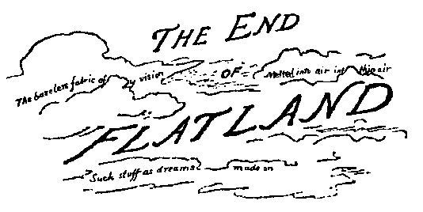

# Introduction

[[@pbdR2012]]


## Installation

You can install the stable version from CRAN using the usual `install.packages()`:

```r
install.packages("pbdML")
```

The development version is maintained on GitHub, and can easily be installed by any of the packages that offer installations from GitHub:

```r
### Pick your preference
devtools::install_github("RBigData/pbdML")
ghit::install_github("RBigData/pbdML")
remotes::install_github("RBigData/pbdML")
```


# Dimension Reduction

<div class="centerfig">
  
  <div class="caption">"Be patient, for the world is broad and wide."  Image from <a href="http://downlode.org/Etext/flatland/contents.html">*Flatland*</a></div>
</div>


## FLD


## Randomized SVD/PCA


## Decomp/Recomp


# Legal

&copy; 2016 Drew Schmidt.

Permission is granted to make and distribute verbatim copies of this vignette and its source provided the copyright notice and this permission notice are preserved on all copies.

Any opinions, findings, and conclusions or recommendations expressed in  this material are those of the authors and do not necessarily reflect the  views of the National Science Foundation.  The findings and conclusions in this article have not been formally disseminated by the U.S. Department of Health \& Human Services nor by the U.S. Department of Energy, and should not be construed to represent any determination or policy of University, Agency, Administration and National Laboratory.

This manual may be incorrect or out-of-date.  The authors assume no responsibility for errors or omissions, or for damages resulting from the use of the information contained herein.


# References
<script language="JavaScript" src="include/headers.js"></script>
