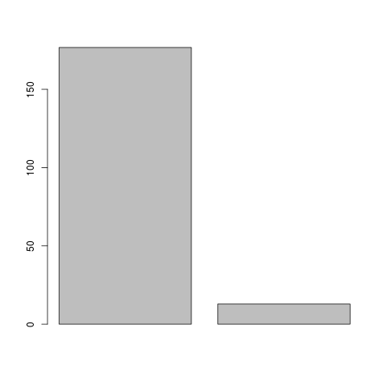
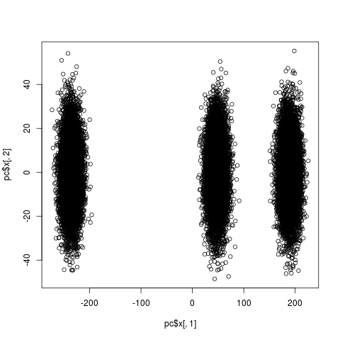
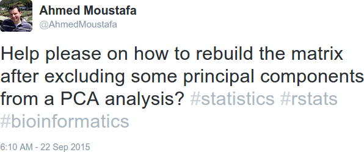
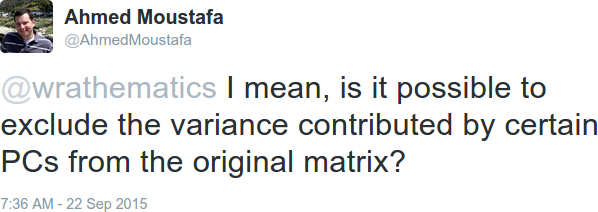

# Introduction

[@pbdR2012]
[@pbdDMAT]
[@pbdMPI]


## Installation
You can install the stable version from CRAN using the usual `install.packages()`:

```r
install.packages("pbdML")
```

The development version is maintained on GitHub, and can easily be installed by any of the packages that offer installations from GitHub:

```r
### Pick your preference
devtools::install_github("RBigData/pbdML")
ghit::install_github("RBigData/pbdML")
remotes::install_github("RBigData/pbdML")
```


# Dimension Reduction

<div class="centerfig">
  
  <div class="caption">"Be patient, for the world is broad and wide."  Image from <a href="http://downlode.org/Etext/flatland/contents.html">*Flatland*</a></div>
</div>


## FLD
TODO


## Randomized SVD/PCA

The singular value decomposition (SVD) is a matrix factorization, with numerous applications [@TODO].  

$$
A = U \Sigma V^T
$$

An application of the SVD well-known to stasticians is principal components analysis (PCA) [@rencher].

A common technique is to compute the first 2 or 3 principal components in order to visualize high-dimensional data.

Estimation
[@halko2011finding]

To show how this works, we generate a $30000\times 5000$ matrix with 3 different separate clusters:

```r
gen <- function(m, n, mean, sd) matrix(rnorm(m*n, mean, sd), m, n)

m <- 10000
n <- 5000
sd <- 10

x1 <- gen(m, n, 0, sd)
x2 <- gen(m, n, 4, sd)
x3 <- gen(m, n, -2, sd)

x <- rbind(x1, x2, x3)
```


```r
library(pbdML)
system.time({
  pc <- rpca(x, k=2)
})
##  user  system elapsed 
## 8.908   4.028  11.674 
```

Compare this to the full PCA computation:

```r
system.time({
  pc.full <- prcomp(x)
})
##    user  system elapsed 
## 644.632 159.220 240.094 
```

The size comparisons are even more striking:

```r
library(memuse)

memuse(x)
## 1.118 GiB
memuse(pc)
## 548.773 KiB
memuse(pc.full)
## 1.304 GiB
```

<!-- ```r
barplot(pc$sdev)
```

<center>

</center> -->

```r
plot(pc$x[, 1], pc$x[, 2])
```

<center>

</center>


## Decomp/Recomp
One day on Twitter, someone asked a very interesting question:

<center>

</center>

After some requests for clarification, the problem was stated as follows:

<center>

</center>


# Legal

&copy; 2016 Drew Schmidt.

Permission is granted to make and distribute verbatim copies of this vignette and its source provided the copyright notice and this permission notice are preserved on all copies.

Any opinions, findings, and conclusions or recommendations expressed in  this material are those of the authors and do not necessarily reflect the  views of the National Science Foundation.  The findings and conclusions in this article have not been formally disseminated by the U.S. Department of Health \& Human Services nor by the U.S. Department of Energy, and should not be construed to represent any determination or policy of University, Agency, Administration and National Laboratory.

This manual may be incorrect or out-of-date.  The authors assume no responsibility for errors or omissions, or for damages resulting from the use of the information contained herein.


# References
<script language="JavaScript" src="include/headers.js"></script>
